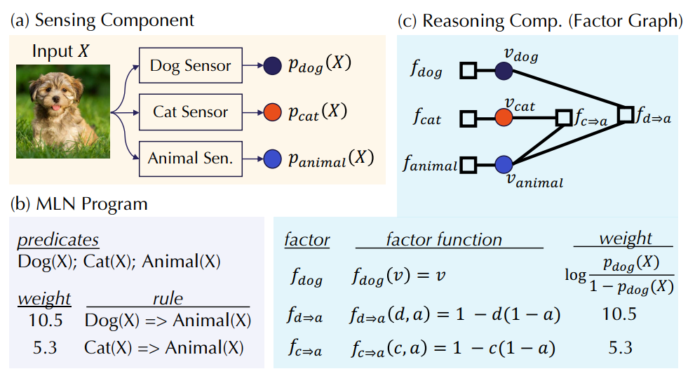

## Robustness for Sensing-Reasoning Machine

+   [论文地址](https://arxiv.org/abs/2003.00120)
+   有一种有趣的解决问题的结构叫做 Sensing-Reasoning pipelines
    +   对于 **Sensing** 层面，我们用若干种不同的模型去感知，得到很多组 $01$ 的随机变量。
    +   对于 **Reasoning** 层面，我们把之前的若干个结果汇总，利用领域知识（domain knowledge）和概率模型去矫正和逼近真实答案。常见的概率模型有：
        +   基于无向图的 Markov logic networks（**MLN**）
        +   基于有向图的 Bayesian networks （其实就是条件概率构建在图上）
    +   论文里介绍了一个有趣的例子：假设我们想判断一张图 $X$ 的信息。
        +   我们在 Sensing 层面设了 Dog Sensor，Cat Sensor 和 Animial Sensor 三个神经网络模型去感知，从而能得到三个概率 $p_1, p_2, p_3$，$p_i$ 表示该图 **是** 物体 $i$ 的概率。
        +   由知识和经验，我们知道猫和狗都是动物，该规律可以在 Reasoning 层面帮我们去矫正之前的概率。
        
+   作为 Reasoning Component 的 Markov Logic Networks 的标准化定义
    +   MLN 其实是一张图 $\mathcal{(V,F)}$ 。
        +   $\mathcal{V=X \cup Y}$ 代表节点集合。 
            +   $\mathcal{X}$ 是为每一个 Sensor 分别创立的点的集合，称为 Interface Variables
            +   $\mathcal{Y}$ 是 MLN 里的其他节点集合，称为 Interior Variables
        +   $\mathcal{F=G \cup H}$ 代表事实（Factor）集合，每个 Factor $f$ 包括权重 $w_f$ 和函数 $F_f$（从 $\mathcal{V}$ 的一个子集映射到 $\{0,1\}$）
            +    $\mathcal{G}$ 对应 $\mathcal{X}$ 子集里每一个点的 Factor，$w_{G_i}=\log{\frac{p_i(X)}{1-p_i(X)}}$，$F_{G_i}(a)=[a=1]$ ，定义域为 $\{x_i\}$，称为 Interface Factors
            +    $\mathcal{H}$ 对应 MLN 里的其他 Factor 集合，称为 Interior Factors
    +   对于任何一个可能的情况，MLN 里的每一个节点都会有一个唯一的 $0$ 或 $1$ 的取值，我们称它为一个 possible world。更规范地来说，一个 possible world 就是一个函数 $\sigma:\mathcal{V} \rightarrow \{0,1\}$ 
    +   一个 MLN 节点的最终预测由以下公式给出
        +   $\mathbb{E}[R_{M L N}(\{p_{i}(X)\}_{i \in[n]})]=\operatorname{Pr}[v=1]
            = \frac{Z_{1}(\{p_{i}(X)\}_{i \in[n]})}{Z_{2}(\{p_{i}(X)\}_{i \in[n]})}$
        +   $Z_{1}(\{p_{i}(X)\}_{i \in[n]})=\sum \limits_{\sigma \in \Sigma \wedge \sigma(v)=1} \exp \{\sum_{G_{i} \in \mathcal{G}} w_{G_{i}} \sigma(x_{i})+\sum_{H \in \mathcal{H}} w_{H} f_{H}(\sigma(\overline{\mathbf{v}}_{H}))\}$
        +   $Z_{2}(\{p_{i}(X)\}_{i \in[n]})=\sum \limits_{\sigma \in \Sigma} \exp \{\sum_{G_{i} \in \mathcal{G}} w_{G_{i}} \sigma(x_{i})+\sum_{H \in \mathcal{H}} w_{H} f_{H}(\sigma(\overline{\mathbf{v}}_{H}))\}$
    +   这里也可以解释为什么 $\mathcal{G}$ 集合里的 Factor 权重要定义为 $\log{\frac{p_i(X)}{1-p_i(X)}}$，因为假设 $\mathcal{H}=\empty$，把这个式子带入预测公式，得到的答案正好是 $p_i(X)$，这是自洽、符合逻辑的。
+   研究 Reasoning Robustness 的 Hardness
    +   **Counting Problem**：给出多项式时间内可计算的权值函数 $w$ 和询问函数 $Q$（相当于一个模型，比如可以用 MLN） 以及一个实数 $\varepsilon_c>0$，要 **求一个Z** 使得 $1-\varepsilon_{c} \leq \frac{Z}{\mathbf{E}_{\sigma \sim \pi_{\alpha}}[Q(\sigma)]} \leq 1+\varepsilon_{c}$
    +   **Robustness Problem**：给出多项式时间内可计算的权值函数 $w$ 和询问函数 $Q$ 以及两个实数 $\epsilon,\delta>0$，对于满足 $|\alpha-\alpha'|_{\infty}<\epsilon$  的任何扰动 $\alpha'$ ，**判定** 是否一直有 $|\mathbf{E}_{\sigma \sim \pi_{\alpha}}[Q(\sigma)]-\mathbf{E}_{\sigma \sim \pi_{\alpha^{\prime}}}[Q(\sigma)]|<\delta$ 。
    +   论文里证明了：COUNTING 问题可以规约到 Robustness 问题，只需判定 $O(\frac{1}{\varepsilon_C^2})$ 次。
        +   我们已知 $\mathbf{E}_{\sigma \sim \pi_{\alpha}}[Q(\sigma)]=\frac{Z_{1}}{Z_{0}+Z_{1}}$，设计权重函数为 $t(\sigma ; \beta)=w(\sigma ; \alpha) \exp (\beta Q(\sigma))$ 的新问题，则这个新问题满足 $\mathbf{E}_{\sigma \sim \tau_{\beta}}[Q(\sigma)]=\frac{e^{\beta} Z_{1}}{Z_{0}+e^{\beta} Z_{1}}$
        +   设 $R=\frac{Z_0}{Z_1}$，我们来评估分布 $\beta$ 偏差了一个 $x$ 后函数值的变化：
            +   偏差 $Y^{+}(\beta, x)=\mathbf{E}_{\sigma \sim \tau_{\beta+x}}[Q(\sigma)]-\mathbf{E}_{\sigma \sim \tau_{\beta}}[Q(\sigma)]=\frac{e^{x} e^{\beta} Z_{1}}{Z_{0}+e^{x} e^{\beta} Z_{1}}-\frac{e^{\beta} Z_{1}}{Z_{0}+e^{\beta} Z_{1}}=\frac{(e^{x}-1) e^{\beta}}{R+(e^{x}+1) e^{\beta}+\frac{e^{x} e^{2 \beta}}{R}}$
            +   同理 $Y^{-}(\beta, x)=\frac{(e^{x}-1) e^{\beta}}{e^{x} R+(e^{x}+1) e^{\beta}+\frac{e^{2 \beta}}{R}}$
            +   上述两式均 $\leq \frac{e^{x / 2}-1}{e^{x / 2}+1}$，且在 $R=e^{\beta \pm x / 2}$ 时取到。
            +   设 $Y(\beta)=\max \{Y^{+}(\beta, x), Y^{-}(\beta, x)\}$，则 $Y(\beta)$ 由 $e^{\beta}$ 和 $R$ 的大小关系决定。
            +   This function $Y$ is increasing in $[0, \log R-x / 2],$ decreasing in $[\log R-x / 2, \log R],$ increasing in $[\log R, \log R+$ $x / 2]$ again, and decreasing in $[\log R+x / 2, \infty)$ once again.
        +   假设 $x$ 是一个 $O(\varepsilon_{c})$ 的定值，**我们的最终目标是估计 $R$**。
        +   首先，如果分布 $\beta$ 已经确定，我们可以二分 $\delta$ + 调用判定，求出误差小于 $\varepsilon_{c}$ 的 $\delta$，也即 $Y(\beta)$ 的值。
        +   我们已经知道了 $Y$ 函数的性质，可以再套一个二分去找极大值点 $\beta_0$，使得 $Y(\beta_{0}) \geq \frac{e^{x / 2}-1}{e^{x / 2}+1}-\varepsilon_{0}$。
        +   根据一番推导，我们找到的这个 $\beta_0$ 满足 $e^{-x}<\frac{R}{e^{\beta_{0}}}<e^{x}$，这样我们便确定了 $R$ 的范围。
        +   最后我们只要设 $x=\log(1+\varepsilon_{c})$，那么要估计的值 $\mathbf{E}_{\sigma \sim \pi_{\alpha}}[Q(\sigma)]=\frac{1}{1+R}$ 的偏差就是 $\varepsilon_{c}$ 了。