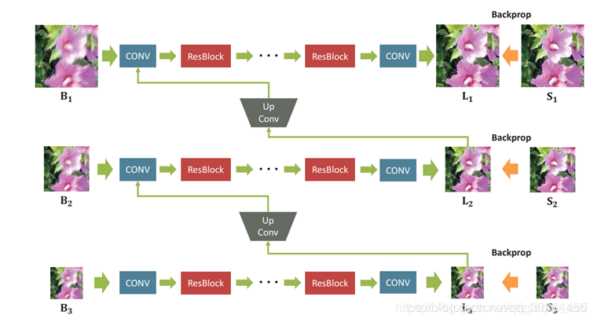

# Image-Deblur

## DeepDeblur

+ CVPR2017，深度卷积神经网络用于运动场景去模糊的[开山之作](https://github.com/SeungjunNah/DeepDeblur_release)。
+ 作者同时给出了运动去模糊领域的常用测试集 GoPro（Train + Test 总计 $3214$ 组数据）。
+ 背景介绍
    + 运动模糊是由式子 $B=K*S+n$ 形成的。
        + $k$ 是作用在 $S$ 上的模糊卷积核，$n$ 是已知的额外噪音。
    + 传统方法也被称为 **盲去模糊**：人们假想一个 $K'$，得 $S=(B-n) \propto  K'$
    + 缺点很明显：难以正确估计出 $K$，且需要更大的感受野。
+ 作者设计了一个多尺度端到端的学习模型
    
    + 采用 multi-scale 后的图片作为输入（$B_1$是原图，$B_2,B_3$ 进行过下采样）
    + 将每一层的去模糊结果（unconv 后）与上一层的图片连接，作为上一层的输入（和 **FPN** 思想类似）。
    + 每一层网络用 ResBlock 连接，确保在这样的深度下不会梯度消失。
    + 损失函数 $f_1=\frac{1}{2K} \sum_{k=1}^K \frac{1}{c_kw_kh_k} ||L_k-S_k||^2$
        + $K$ 是 multi-scale 的图片层数，$L_k$ 和 $S_k$ 分别是模型输出和 GT，图片不等大所以加了一个归一化。
        + 作者居然还用到了 GAN 的思想，构造了判断图片是否模糊的学习器，把评估后的 loss 设为 $f_2$。
        + $f=f_1+\lambda f_2$，注意作者还专门讨论了是否要加 $f_2$，加不加各有千秋。
+ 生成图像和 GT 的相似度评估
    + PSNR（Peak Signal-to-Noise Ratio）峰值信噪比
        + 一个很自然的想法是利用均方误差：$\mathrm{MSE}=\frac{1}{mn} \sum_{i=0}^{m-1} \sum_{j=0}^{n-1}[I(i,j)-K(i,j)]^2$
        + PSNR 在 MSE 的基础上做了伸缩： $\mathrm{PSNR}=10 \cdot \log _{10}\left(\frac{M A X^{2}}{M S E}\right)$ 。MAX 是像素的最大可能的值。
    + SSIM（Structural Similarity）结构相似性
        + 三方面去考察：亮度 $l(\mathbf{x}, \mathbf{y})=\frac{2 \mu_{x} \mu_{y}+C_{1}}{\mu_{x}^{2}+\mu_{y}^{2}+C_{1}}$，对比度 $c(\mathbf{x}, \mathbf{y})=\frac{2 \sigma_{x} \sigma_{y}+C_{2}}{\sigma_{x}^{2}+\sigma_{y}^{2}+C_{2}}$，结构 $s(\mathbf{x}, \mathbf{y})=\frac{\sigma_{x y}+C_{3}}{\sigma_{x} \sigma_{y}+C_{3}}$。
        + $C_1,C_2,C_3$ 是为了避免分母为 $0$ 的小常数。
        + $\operatorname{SSIM}(\mathbf{x}, \mathbf{y})=[l(\mathbf{x}, \mathbf{y})]^{\alpha}[c(\mathbf{x}, \mathbf{y})]^{\beta}[s(\mathbf{x}, \mathbf{y})]^{\gamma}$ ，一般取 $\alpha=\beta=\gamma=1, \quad C_{3}=C_{2} / 2$
        + 所以我们有 $\operatorname{SSIM}(\mathbf{x}, \mathbf{y})=\frac{\left(2 \mu_{x} \mu_{y}+C_{1}\right)\left(\sigma_{x y}+C_{2}\right)}{\left(\mu_{x}^{2}+\mu_{y}^{2}+C_{1}\right)\left(\sigma_{x}^{2}+\sigma_{y}^{2}+C_{2}\right)}$

## SRN-DeblurNet

+   腾讯优图实验室 CVPR2018
+   和 DeepDeblur 的网络结构差不多，在它的基础上加了点 LSTM 的思想。
    
    +   在不同尺度下识别图片，每层用 **Encoder-Decoder** 的思想构建网络。
    +   除了采用 DeepBeblur 里的上采样合并的 trick 外，还把 Encoder 的最中心用 LSTM 的思想串起来。
    +   提出**在不同尺度上共享网络权重**（图中可以感受到），从而降低训练复杂度、增加稳定性。
    +   （感觉至少稍微加了点创新性啊）