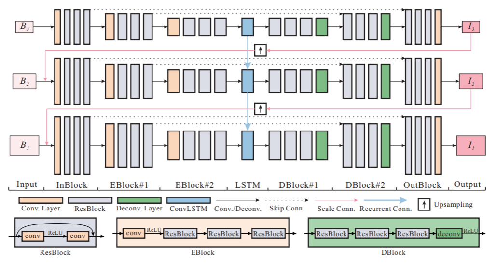

# Image-Deblur

## DeepDeblur

+ CVPR2017，深度卷积神经网络用于运动场景去模糊的[开山之作](https://github.com/SeungjunNah/DeepDeblur_release)。
+ 作者同时给出了运动去模糊领域的常用测试集 GoPro（Train + Test 总计 $3214$ 组数据）。
+ 背景介绍
    + 运动模糊是由式子 $B=K*S+n$ 形成的。
        + $k$ 是作用在 $S$ 上的模糊卷积核，$n$ 是已知的额外噪音。
    + 传统方法也被称为 **盲去模糊**：人们假想一个 $K'$，得 $S=(B-n) \propto  K'$
    + 缺点很明显：难以正确估计出 $K$，且需要更大的感受野。
+ 作者设计了一个多尺度端到端的学习模型
    
    + 采用 multi-scale 后的图片作为输入（$B_1$是原图，$B_2,B_3$ 进行过下采样）
    + 将每一层的去模糊结果（unconv 后）与上一层的图片连接，作为上一层的输入（和 **FPN** 思想类似）。
    + 每一层网络用 ResBlock 连接，确保在这样的深度下不会梯度消失。
    + 损失函数 $f_1=\frac{1}{2K} \sum_{k=1}^K \frac{1}{c_kw_kh_k} ||L_k-S_k||^2$
        + $K$ 是 multi-scale 的图片层数，$L_k$ 和 $S_k$ 分别是模型输出和 GT，图片不等大所以加了一个归一化。
        + 作者居然还用到了 GAN 的思想，构造了判断图片是否模糊的学习器，把评估后的 loss 设为 $f_2$。
        + $f=f_1+\lambda f_2$，注意作者还专门讨论了是否要加 $f_2$，加不加各有千秋。
+ 生成图像和 GT 的相似度评估
    + PSNR（Peak Signal-to-Noise Ratio）峰值信噪比
        + 一个很自然的想法是利用均方误差：$\mathrm{MSE}=\frac{1}{mn} \sum_{i=0}^{m-1} \sum_{j=0}^{n-1}[I(i,j)-K(i,j)]^2$
        + PSNR 在 MSE 的基础上做了伸缩： $\mathrm{PSNR}=10 \cdot \log _{10}(\frac{M A X^{2}}{M S E})$ 。MAX 是像素的最大可能的值。
    + SSIM（Structural Similarity）结构相似性
        + 三方面去考察：亮度 $l(\mathbf{x}, \mathbf{y})=\frac{2 \mu_{x} \mu_{y}+C_{1}}{\mu_{x}^{2}+\mu_{y}^{2}+C_{1}}$，对比度 $c(\mathbf{x}, \mathbf{y})=\frac{2 \sigma_{x} \sigma_{y}+C_{2}}{\sigma_{x}^{2}+\sigma_{y}^{2}+C_{2}}$，结构 $s(\mathbf{x}, \mathbf{y})=\frac{\sigma_{x y}+C_{3}}{\sigma_{x} \sigma_{y}+C_{3}}$。
        + $C_1,C_2,C_3$ 是为了避免分母为 $0$ 的小常数。
        + $\operatorname{SSIM}(\mathbf{x}, \mathbf{y})=[l(\mathbf{x}, \mathbf{y})]^{\alpha}[c(\mathbf{x}, \mathbf{y})]^{\beta}[s(\mathbf{x}, \mathbf{y})]^{\gamma}$ ，一般取 $\alpha=\beta=\gamma=1, \quad C_{3}=C_{2} / 2$
        + 所以我们有 $\operatorname{SSIM}(\mathbf{x}, \mathbf{y})=\frac{(2 \mu_{x} \mu_{y}+C_{1})(\sigma_{x y}+C_{2})}{(\mu_{x}^{2}+\mu_{y}^{2}+C_{1})(\sigma_{x}^{2}+\sigma_{y}^{2}+C_{2})}$

## SRN-DeblurNet

+   腾讯优图实验室 CVPR2018

+   和 DeepDeblur 的网络结构差不多，在它的基础上加了点 LSTM 的思想。
    
    +   在不同尺度下识别图片，每层用 **Encoder-Decoder** 的思想构建网络。
    +   除了采用 DeepBeblur 里的上采样合并的 trick 外，还把 Encoder 的最中心用 LSTM 的思想串起来。
    +   提出**在不同尺度上共享网络权重**（图中可以感受到），从而降低训练复杂度、增加稳定性。
    +   跑起来效果还是挺不错的，实测 GPU 上单张照片测试耗时 1~2 s。
    
## DeblurGAN

+   这是一篇 ECCV2018 的论文。[论文地址](file:///F:/deblur/DeblurGAN/1711.07064.pdf)
+   作者提出了一种 “随机轨道法“（random trajectories）用来生成模糊的图像。
+   [一个很棒的WGAN讲解](https://www.cnblogs.com/Allen-rg/p/10305125.html)
+   网络架构
    +   总体架构就是普通的 GAN 网络。
    +   Generator 的 CNN 网络结构
        
        +   包含两个1/2间隔的卷积单元、9个 ResBlock 和两个反卷积单元。每个 ResBlock 由一个卷积层、归一化层和 ReLU 激活组成。
        +   作者还强调加了一层 skip connection 来加速学习、提高效果。
    +   Discriminator 的网络结构与 PatchGAN 相同（image-to-image translation 论文中采用的判别网络）。
+   Loss 函数设计
    +   **Discriminator Loss**：
        +   同 WGAN 的原理：$\mathbb{E}_{x \sim P_{g}}\left[f_{w}(x)\right]-\mathbb{E}_{x \sim P_{r}}[f_{w}(x)]$
        +   也可以加上 $\underset{\tilde{x} \sim P_{z}}{\mathbb{E}}[(\|\nabla_{\tilde{x}} D(\tilde{x})|_{2}-1)^{2}]$ 这部分来有效的限制 Lipschitz 条件中的 $K$
    +   **Generator Loss**：
        +   同 WGAN 的原理：$-\mathbb{E}_{x \sim P_{g}}\left[f_{w}(x)\right]$
        +   再加上 **Perceptual Loss**：$\mathcal{L}_{X}=\frac{1}{W_{i, j} H_{i, j}} \sum_{x=1}^{W_{i, j}} \sum_{y=1}^{H_{i, j}}(\phi_{i, j}(I^{S})_{x, y}-\phi_{i, j}(G_{\theta_{G}}(I^{B}))_{x, y})^{2}$
        +   注意作者做的 **不是原图上的 MSE，而是 feature map 上的 MSE**。$W,H$ 是 feature map 的尺寸。

## DeblurGAN-v2

+   这是一篇 ICCV2019 的论文，[论文地址](https://arxiv.org/abs/1908.03826)
+   改进了第一版里 GAN 的框架
    
    +   在 Generator 里使用 **FPN（图像金字塔）**结构，将五层不同尺度的合在了一起。
        +   感觉这个结构就是抄 DeepDeblur 和 SRN-Deblur 里的多尺度啊，只是这里作者显式地说明了这是 FPN。
        +   每层的结构都一致，卷积层+池化层。注意最终也添加了一个 Skip Connection，学习残差。
    +   采用 Double-Scale RaGAN-LS Discriminator
        +   不再像 DeblurGAN 那样用 WGAN-GP 算 loss，而是适配了 **LSGAN**，作者发现这样更快也更稳定。
        +   $L_{D}^{R a L S G A N}=E_{x p_{\text {lata}}(x)}\left[\left(D(x)-E_{z p_{z}(z)} D(G(z))-1\right)^{2}\right]+E_{z p_{z}(x)}\left[\left(D(G(z))-E_{x p_{\text {data}}(x)} D(x)+1\right)^{2}\right]$
        +   用了 **全局** 和 **局部** 两个尺度。除了应用 DeblurGAN 里的局部裁剪（$70 \times 70$）的 PatchGAN，还加了一个整张图的大尺度。
    +   总的 Loss 计算函数：$L_{G}=0.5 * L_{p}+0.006 * L_{X}+0.01 * L_{a d v}$
        +   $L_X$ 就是 DeblurGAN 里 feature map 的比较。
        +   作者还加上了像素值 MSE 的 $L_p$ ，称可以减少颜色和纹理的扭曲。
+   测试结果挺不错，把当前的 SOTA 都虐了一遍（括号里的区别是生成器里每个单位使用的 CNN 结构）。
