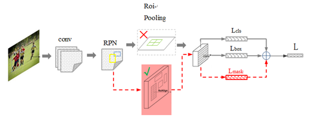

## 图像分割的简单分类

## Mask R-CNN

+ Mask R-CNN 应用于实例分割（Instance Segmentation），从目标检测里的 Faster R-CNN 发展而来。
    
+ RoI Align V.S. RoI Pooling
    + Fast R-CNN 将不同尺度不同大小的特征图 Pooling 成相同尺寸的块（如 $7 \times 7$）。
    + 注意 原图 $\rightarrow$ 特征图、RoI Polling 这两个步骤都会丢失精度，所以 RoI 映射回原图会造成误差（在目标检测中框位置的偏移无伤大雅，但是实例分割里的掩码对误差很敏感）。
    + Mask R-CNN 采用 RoI Align 技术：所有计算都用实数表示坐标，因此最后映射回原图也是实数坐标；对相邻四个整数像素做 **双线性插值** 即可得到精确值。
+ 损失函数中添加 $L_{mask}$
    + 在实例分割中，还需给出一个二值掩码用来勾勒检测物体的轮廓。
    + 在 Mask 分支里，对每个 RoI 用 **FCN** 来预测二值掩码。输出维度是 $C \times m^2$，其中 $C$ 是分类种数， $m$ 是相同尺寸的块的边长。损失函数在 $L_{cls}$ 和 $L_{box}$ （边框的分类和回归）的基础上增加 $L_{mask}$ 部分。
    + 直接对多类别用 $\mathrm{Softmax}$ 再交叉熵计算损失函数是不准确的，因为类之间会互相干扰。所以作者只取了预测出来的这个类别，用这 $m^2$ 个数据（$\mathrm{Sigmoid}$ 后）的二值交叉熵平均值作为 $L_{mask}$。
    + 训练时 $L_{mask}$ 仅在预测正确的 RoI 上有定义。

