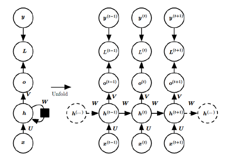
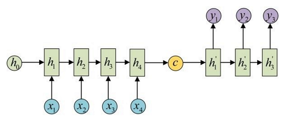
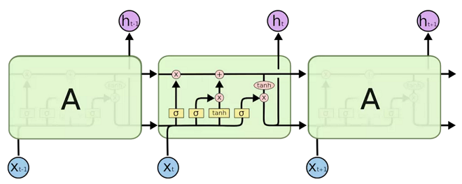
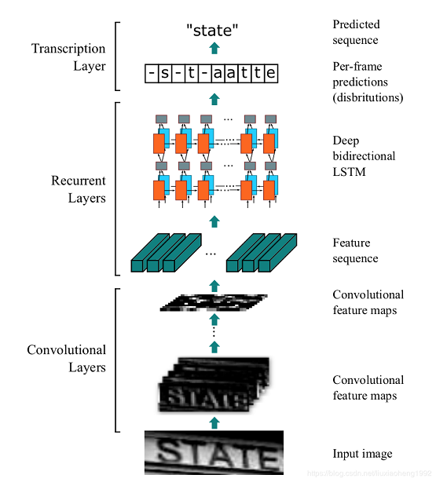
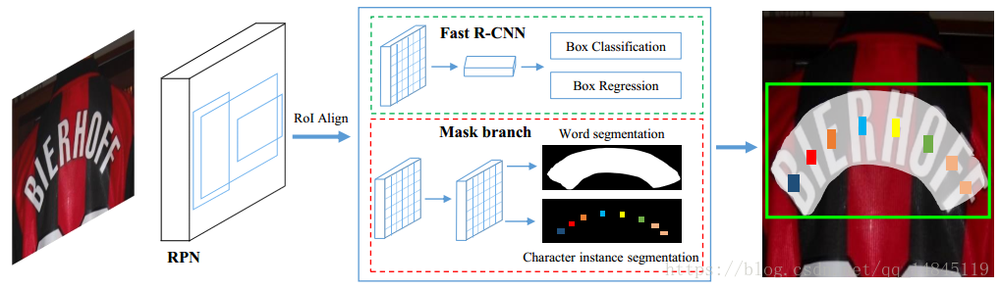

# Paper Learning
 > try to learn some classical papers and algorithms in machine learning

## Recurrent Neural Network

#### 基本概念

+ 注：[参考此文章进行学习和总结](https://blog.csdn.net/zhaojc1995/article/details/80572098)
+ RNN（Recurrent Neural Network）是一类用于处理序列数据的神经网络。抽象地来说，要让网络有**记忆**的特性。
	

     $$h^{(t)}=\Phi(Ux^{(t)}+Wh^{(t-1)}+b)$$
+ 激活函数 $\Phi$ 一般用 $\tanh$ 或者 $\sigma$(sigmoid)，反向传播容易**梯度爆炸**。
+ 用到了**参数共享**的思路。每一个时间（序列）下的神经元节点共用相同的结构和参数。实际操作的时候，将每个时间下的输入 $x_t$ 依次传入网络。
+ 如果同时需要前后文的记忆，可以用**双向RNN**：$x_t$ 同时由 $x_{t-1}$ 和 $x_{t+1}$ 决定。
+ 以上结构应用在输出和读入的长度相等，其实还有很多变式。如下图表示不相等时的结构（可以用于翻译）。这其实是一个 `encoder-decoder` 的思想。
	
+ 应用
	- Many to one：分类问题（词性判断，关键字提取）
	- Many to many 文本翻译（Seq2Seq），语音翻译
	- CNN+RNN：用文字描述图片特征

#### LSTM

+ 传统 RNN 的记忆效果不是很好，不适合需要长期记忆的任务。
+ LSTM 全称 `Long Short Term Memory Networks`，能一定程度上解决长时依赖问题。
	
+ 注意每次传进来有两个通道：上层是 $C_{t-1}$（前一层的记忆），下层是 $h_{t-1}$（前一层的输出）。本神经元的计算方法：
	- 左下往上那一路：计算上层记忆的衰减系数。它是由上层输出和这一时刻的输入决定的：$f_t=\sigma(W_f \cdot [h_{t-1},x_t]+b_f)$。
	- 左下角往中间那一路：计算当前时刻的记忆及其衰减系数。$C_t=\tanh(W_C \cdot [h_{t-1},x_t] + b_C)$，$i_t=\sigma(W_i \cdot [h_{t-1},x_t]+b_i)$.
	- 右上新的记忆：$C'_t=f_tC_{t-1}+i_tC_t$
	- 右下本层输出：$h_t=o_t \tanh(C_t)$。$o_t$ 是输出前乘的系数，计算公式和上述类似：$o_t=\sigma(W_o[h_{t-1},x_t]+b_o)$
+ **GRU**（`gated recurrent unit`） 本质上是简化后的 LSTM。它去掉了 $C_t$ 的结构，记忆元由 $h_t$ “兼任”。

## CTC 算法

+ CTC 全称 `Connectionist Temporal Classification`，用来解决时序类数据的分类问题，多用于手写字符识别和语音识别。
+ 如果套接了RNN，每个时间片都有一组概率 $p(y|t)$，表示这个时间片是某个字的概率。CTC 的主要思想是，去寻找一个最大的 $Y$，满足 $P(Y|X)$ 尽量的大。
+ 对齐
	- 紧挨着的时间片如果是相同字符，会被合在一起。
	- CTC 引入空字符 $\epsilon$（blank），用来断开字母。
	- 下图便是某个识别为 `hello` 的例子：
		
+ 损失函数的计算
	- 值得注意的是，由于 CTC 这套合并和分离的方法，**同一个序列结果可能有多种识别方式。**
	- 一个结果其实是对应一个概率和。即 $P(Y|X)=\sum_i \prod p_i(y_t|x_t)$，$\sum$ 表示导致这个结果的不同路径。
	- 计算概率的方法很显然，在路径下 $O(N^2)$ dp 即可。
	- dp过程中只有加法和乘法，显然可以反向传播。
+ 模型训练好后的预测
	- 有一个简单的贪心预测，每一个时间片直接取 $p(y_t|x_t)$ 最大的字母串起来。
	- `Beam search` 算法变形。每次保留 $k$ 条概率和最大的路径。
+ 总结 CTC 的一些性质
	- 接受了序列 $X$ 后，CTC导出的序列 $Y$ 满足 $|Y| \leq |X|$（多对一模型）。
	- CTC 是假设每个时间片都是相互独立的，没有挖掘其中的语义。

## 序列识别：CRNN算法

+ [论文地址](https://arxiv.org/abs/1507.05717)
+  **经典的端到端训练**。通过 CNN 将图片的特征提取出来后采用 RNN 对序列进行预测，最后通过一个 CTC 的翻译层得到最终结果。说白了就是 `CNN + RNN + CTC`的结构。
	
+ CNN 是直接在 VGG 基础上修改的。序列识别时，要求图片的维度是 $W \times 32$（宽度任意，高度要 resize 成 32）。将 VGG 网络的第三层、第四层 `pooling` 的卷积核从 $2 \times 2$ 改成 $1 \times 2$。结合四层 `pooling` 和最后一层 `conv`，卷积完成后的维度是 $\frac{W}{4} \times 1$。
+ 双向 RNN，用 LSTM 作为基本结构。
+ 结尾处直接套一个 `CTC` 算法。

## 文本检测与识别：Mask TextSpotter

+ **端到端**，旨在处理 STS（Scene Text Spotting）问题。
+ 大部分做法都是把检测和识别分开。Mask TextSpotter 受到 Mask R-CNN 的启发，通过分割文本区域检测文本，**从而能识别弯曲的文本。**
+ 训练结构
	
+ ROI
	- ROI Pooling
		+ 在传统的两级检测框架中，常用 ROI Pooling 作为原图像和 `feature map` 的转化
		+ 预选框回归后是浮点数，从原图转到 `feature map` 取整会丢失像素，在割 $k \times k$ 特征池化的时候也会遇到不整除的问题。这些问题累积后，还原到原图上就会有很大的误差。
		+ 该现象被称为 **不匹配问题（misalignment）**。
	- ROI Align
		+ 该思想在 **Mask-RCNN** 中首先被提出。
		+ ROI Align 在遍历候选区域、分割单元的时候都不做取整处理。
		+ 在每个单元中计算固定四个坐标位置，（由于坐标是浮点数）采用双线性插值去插出这四个位置的值，然后进行最大池化操作。
		+ **要注意反向传播的问题**，先留个坑。
+ 创新点 **Mask Branch**：

## 目标检测：YOLO（待填坑）

+ [论文地址](http://arxiv.org/abs/1506.02640)
+  注：[参考此文章进行学习和总结](https://blog.csdn.net/guleileo/article/details/80581858)
+ 核心思想：利用整张图作为网络的输入，直接在输出层回归 bounding box 的位置及其所属的类别。
+ 实现方法
	1. 将整个图片分成 $S \times S$ 的网格（每个网格是一个预测单元。如果有一个 object 中心落入其中，就由它进行预测）。
	2. 每个网格都来预测 $B$ 个
