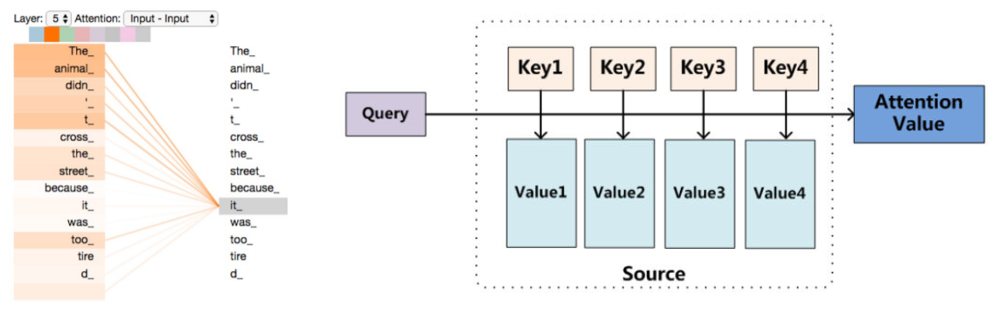
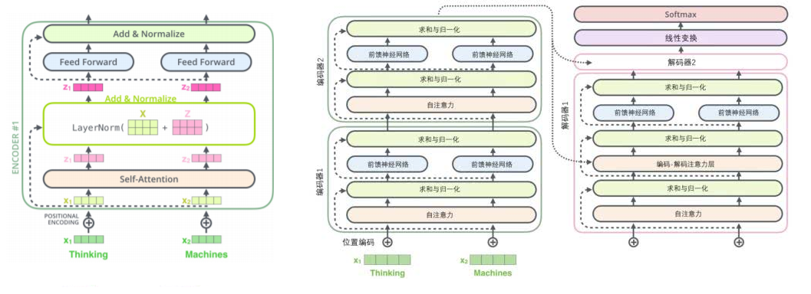

## RNN

+ 注：[参考此文章进行学习和总结](https://blog.csdn.net/zhaojc1995/article/details/80572098)
+ RNN（Recurrent Neural Network）是一类用于处理序列数据的神经网络。抽象地来说，要让网络有**记忆**的特性。
	

     $$h^{(t)}=\Phi(Ux^{(t)}+Wh^{(t-1)}+b)$$
+ 激活函数 $\Phi$ 一般用 $\tanh$ 或者 $\mathrm{sigmoid}$，反向传播容易**梯度爆炸**。
+ 用到了**参数共享**的思路。每一个时间（序列）下的神经元节点共用相同的结构和参数。实际操作的时候，将每个时间下的输入 $x_t$ 依次传入网络。
+ 如果同时需要前后文的记忆，可以用**双向RNN**：$x_t$ 同时由 $x_{t-1}$ 和 $x_{t+1}$ 决定。
+ 以上结构应用在输出和读入的长度相等，其实还有很多变式。如下图表示不相等时的结构（可以用于翻译）。这其实是一个 `encoder-decoder` 的思想。

	
+ 应用
	- Many to one：分类问题（词性判断，关键字提取）
	- Many to many 文本翻译（Seq2Seq），语音翻译
	- CNN+RNN：用文字描述图片特征

## LSTM

+ 传统 RNN 的记忆效果不是很好，不适合需要长期记忆的任务。
+ LSTM 全称 `Long Short Term Memory Networks`，能一定程度上解决长时依赖问题。
	
+ 注意每次传进来有两个通道：上层是 $C_{t-1}$（前一层的记忆），下层是 $h_{t-1}$（前一层的输出）。本神经元的计算方法：
	- 左下往上那一路：计算上层记忆的衰减系数。它是由上层输出和这一时刻的输入决定的：$f_t=\sigma(W_f \cdot [h_{t-1},x_t]+b_f)$。
	- 左下角往中间那一路：计算当前时刻的记忆及其衰减系数。$C_t=\tanh(W_C \cdot [h_{t-1},x_t] + b_C)$，$i_t=\sigma(W_i \cdot [h_{t-1},x_t]+b_i)$.
	- 右上新的记忆：$C'_t=f_tC_{t-1}+i_tC_t$
	- 右下本层输出：$h_t=o_t \tanh(C_t)$。$o_t$ 是输出前乘的系数，计算公式和上述类似：$o_t=\sigma(W_o[h_{t-1},x_t]+b_o)$
+ **GRU**（`gated recurrent unit`） 本质上是简化后的 LSTM。它去掉了 $C_t$ 的结构，记忆元由 $h_t$ “兼任”。

## convLSTM

+ [论文地址](https://arxiv.org/abs/1506.04214v1)

+ convLSTM 其实就是把 LSTM 里读入输出的数字换成了图像，除了时间外额外关注了**空间上的相关性**。
+ 此时 $\mathcal{X}_t,\mathcal{H}_t, \mathcal{C}_t$ 都是二维的（如果算上图像的通道数，也可算作三维），而对应的 $W$ 就可以换做卷积。
+ 作者观察到：若 $W$ 的卷积核越大，就能够捕获更快的动作。

## CTC算法

+ CTC 全称 `Connectionist Temporal Classification`，用来解决时序类数据的分类问题，多用于手写字符识别和语音识别。
+ 如果套接了RNN，每个时间片都有一组概率 $p(y|t)$，表示这个时间片是某个字的概率。CTC 的主要思想是，去寻找一个最大的 $Y$，满足 $P(Y|X)$ 尽量的大。
+ 对齐
	- 紧挨着的时间片如果是相同字符，会被合在一起。
	- CTC 引入空字符 $\epsilon$（blank），用来断开字母。
	- 下图便是某个识别为 `hello` 的例子：
		
+ 损失函数的计算
	- 值得注意的是，由于 CTC 这套合并和分离的方法，**同一个序列结果可能有多种识别方式。**
	- 一个结果其实是对应一个概率和。即 $P(Y|X)=\sum_i \prod p_i(y_t|x_t)$，$\sum$ 表示导致这个结果的不同路径。
	- 计算概率的方法很显然，在路径下 $O(N^2)$ dp 即可。
	- dp过程中只有加法和乘法，显然可以反向传播。
+ 模型训练好后的预测
	- 有一个简单的贪心预测，每一个时间片直接取 $p(y_t|x_t)$ 最大的字母串起来。
	- `Beam search` 算法变形。每次保留 $k$ 条概率和最大的路径。
+ 总结 CTC 的一些性质
	- 接受了序列 $X$ 后，CTC导出的序列 $Y$ 满足 $|Y| \leq |X|$（多对一模型）。
	- CTC 是假设每个时间片都是相互独立的，没有挖掘其中的语义。

## Attention

+   Encoder-Decoder 模型有一个明显的缺陷：Encoder 后的向量是信息的全部表达，输入长时效果会变差。
+   注意力机制的原理很简单：在解码每一个输出向量的时候，不同的输入向量肯定占有不同的比重。所以在解码的时候，每一步都会**选择性地从输入序列中挑选相关向量进行处理**。
    
+   将 encoder 的输入抽象成三个向量 $\mathrm{(Query,Key,Value)}$，那么注意力机制就是**一个查询（Query）到一系列（键 Key-值 Value）对的映射**，即 $\mathrm{Attention=Softmax(Similar(Q,K))V}$。
    1.   将 Query和每个 Key 进行相似度计算（点积，拼接，感知机等）得到 **权重**。
    2.   使用 softmax 函数对这些权重进行归一化；
    3.   最后将权重和相应的值 Value 进行加权求和得到最后的 Attention。
+   Attention 的一些分类
    +   Soft Attention：可被嵌入到模型中去进行训练并传播梯度
        +   Global Attention：对所有 encoder 输出进行计算，比较慢，也是我们常用的 Attention 做法。
        +   Local Attention：会预测一个位置并选取一个窗口进行计算
    +   Hard Attention：依据概率对 encoder 的输出采样，在反向传播时需采用蒙特卡洛进行梯度估计。

## Transformer

+   Google 提出了解决 seq2seq 问题的 Transformer 模型，用全 Attention 的结构代替了 Lstm。

    

+   Encoder 设计

    +   权重矩阵计算公式为 $\mathrm{Attention=Softmax(\frac{Q \times K^T}{\sqrt {d}}) \cdot V}$，其中 $\mathrm{Q[N,d],K[M,d],V[M,d]}$。
        +   设一共有 $N$ 次查询，一共有 $M$ 种键值对应关系，每一个单词的词向量长度是 $d$ 。
        +   除掉 $\sqrt d$ 是为了梯度更稳定。
        +   采用 multi-headed attention 技术，即取  $t$ 组 不同的 $(Q,K,V)$ 一起训练。最终其实只需要 $[N,d]$ 的权重矩阵。可以将 $t$ 个矩阵直接连接成 $[N,td]$ 大小，再乘上一个 $[td,d]$ 的待确定的矩阵 $W$（因为后接神经网络，$W$ 的参数也一起参与训练）。
    +   提出了 Positional Encoding 方法，为了解决 Self-Attention 机制的权重策略带来的弱化了顺序的问题。获得输入单词的词嵌入后，给其（按位）加上一个位置编码向量。
    +   额外在每一层添加残差（Residuals）模块。

+   Decoder 设计

    +   解码器的结构与编码器类似，会从上层继承向量信息然后做一步 Self-Attention。
    +   注意解码器每一层还会额外添加一个来自编码器输出的注意力机制。
    +   解码完毕后接一个线性变换层，把得到的若干个词向量投射到比它大得多的对数几率（logits）的向量里，相当于建立对每一个可能的输出单词之间权重大小。最后经过 Softmax 转化成概率分布。
    +   最后与 GT 做交叉熵或者 KL 散度来建立 loss。