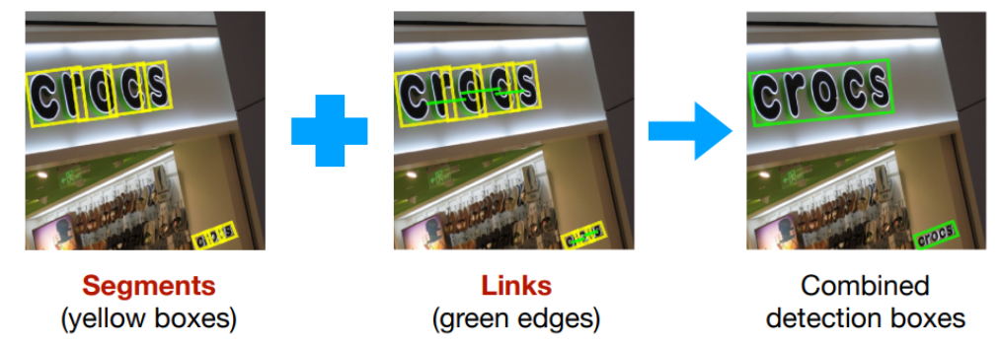
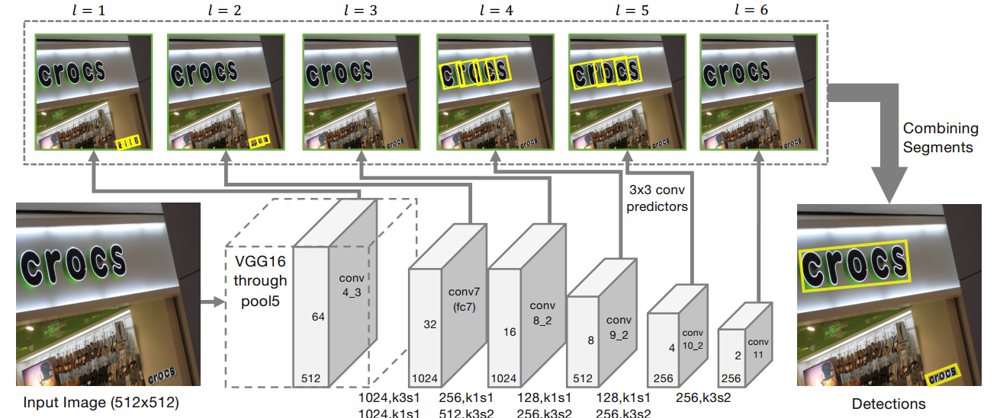

## CRNN

+ 直接通过 **端到端训练** 实现文本检测和文本识别。 [CVPR2015](https://arxiv.org/abs/1507.05717)
+  用 CNN 将图片的特征提取出来后采用 RNN 对序列进行预测，最后通过一个 CTC 的翻译层得到最终结果。
	
+ CNN 是直接在 VGG 基础上修改的。序列识别时，要求图片的维度是 $W \times 32$（宽度任意，高度要 resize 成 32）。将 VGG 网络的第三层、第四层 `pooling` 的卷积核从 $2 \times 2$ 改成 $1 \times 2$。结合四层 `pooling` 和最后一层 `conv`，卷积完成后的维度是 $\frac{W}{4} \times 1$。
+ 双向 RNN，用 LSTM 作为基本结构。结尾处直接套一个 `CTC` 算法。

## CTPN

+ 文本检测的先驱之作。[ECCV2016](https://arxiv.org/pdf/1609.03605.pdf)
+ CTPN (Connectionist Text Proposal Network) 从 Faster R-CNN 修改而来。假设了**文字是横排的**，对单个字符做目标检测后把框都合并起来。
+ 基本步骤
    1. 继承了 Anchor 的思想。作者限定了 Anchor 的宽度 $w=16$，而高度在 $[11,273]$ 之间等比设置 $10$ 个。
    
    2. 用 VGG16 的前 $5$ 个 Conv stage 得到 feature map.
    3. 用 $3 \times 3$ 的滑动窗口在前一步得到的 feature map 上提取特征（每单位都结合邻域，一般是周围九宫格提取，也有实现是取横着一排九个），所以输出为 $[N,9C,H,W]$.
    4. 将 $Batch=NH$，最大时间 $T_{max}=W$ 的数据流输入到 **双向 LSTM**，学习每一行的序列特征。
    5. 输出层和 Faster RCNN 类似。如果每个单位预测 $k$ 个 Anchor 的话，回归 $2k$ 个坐标（矩形高度和中心的 $y$ 偏移值）和 $2k$ 个分数（是文字/不是文字）以及 $k$ 个 side-refinement（表示每个 proposal 的水平平移量，用来精修文本行的两个端点）。
    6. 做一遍 NMS 后，使用基于图的文本行构造算法，将得到的一个一个的文本段合并成文本行。
    
+ 训练
    - 坐标最终计算同 Faster RCNN，loss 即为三个回归值的超参结合。
    - 定义 IoU $> 0.7$ 和最大值为正样本（哈哈干脆两个都用上了），$< 0.5$ 为负样本。
+ 文本段合并的细节
    - 只保留分数 $> 0.7$ 的框。
    - 定义 $(i,j)$ 临近为：
        - $j$ 和 $i$ 的水平距离小于 $50$ pixel
        - 垂直方向重叠 $> 0.7$
    - 从框 $i$ 出发，找到和它临近的分数最高的框 $j$；再从 $j$ 反方向出发，找到对应的 $k$。
    - 如果 $score_i \ge score_k$，说明这是一个“最长的连接”，那么设 $G_{i,j}=True$
    - 这样我们可以对 $N$ 个框建出一个 $N^2$ 的图了。

## SegLink

+ SegLink 是一种可以检测任意角度文本的检测算法。[CVPR2017](https://arxiv.org/pdf/1703.06520.pdf)
+ 融合 CTPN 小尺度候选框和 SSD 算法，达到了当时自然场景下文本检测 SOTA 效果。
+ 每一个 Segment 是文本行的一部分（下图黄色部分），相邻的 Segment 通过 Link 组合起来。
    
+ 基本步骤
    + 依然使用 VGG16 作为 backbone 进行特征提取。
    + 从 VGG16 出来后做一个多尺度的特征提取，以检测不同尺寸的文字（multi-scale 的思想哪里都好使）。
    + 多学习一个旋转角的参数。即从回归 $(x,y,w,h)$ 变成回归 $(x,y,w,h,\theta)$。
    + 除了五个矩形框参数和两个是否有文字的置信度之外，还要回归 Link 相关的参数。
        + Within-layer Link：在同层 $8$ 个方向上判断是否相连，是/否都有置信度总共 $16$ 个参数。
        + Cross-layer Link：和前一层相关的 $4$ 邻域相连，一共 $8$ 个参数，用来减少冗余。
    + 每一个尺度的 feature map 都导出一个结果，用特定的 **融合规则**（combining segments）合并。
    + Loss 即为回归值偏差（$\mathrm{L1~regression}$）和 Link 的偏差（$\mathrm{Softmax}$）。
    
    

## Mask TextSpotter

+ Mask TextSpotter 受到 Mask R-CNN 的启发，通过引入分割的思想进行 **端到端** 训练，从而达到检测和识别任意形状文本的目的。 [ECCV2018](https://arxiv.org/abs/1807.02242)
+ 训练结构
    
    + 采用 ResNet+FPN 提取特征。
    + 用 RPN 生成大量的文本候选框，接着将候选框的 **RoI 特征** 分别送入 Fast RCNN 分支和 mask 分支。
        - ROI Pooling
            + 在传统的两级检测框架中，常用 ROI Pooling 作为原图像和 `feature map` 的转化
            + 预选框回归后是浮点数，从原图转到 `feature map` 取整会丢失像素，在割 $k \times k$ 特征池化的时候也会遇到不整除的问题。这些问题累积后，还原到原图上就会有很大的误差。
            + 该现象被称为 **不匹配问题（misalignment）**。
        - ROI Align
            + 该思想在 **Mask-RCNN** 中首先被提出。
            + ROI Align 在遍历候选区域、分割单元的时候都不做取整处理。
            + 在每个单元中计算固定四个坐标位置，（由于坐标是浮点数）采用双线性插值去插出这四个位置的值，然后进行最大池化操作。
            + **要注意反向传播的问题**。
    + 创新点： **Mask Branch**：
        
        + 输入的 RoI 特征图经过 $4$ 个卷积核和 $1$ 个反卷积，最后输出 $38$ 张大小为 $32 \times 128$ 的图，包括 $１$ 个全局文本实例分割图（即任意形状文本的精确位置）、$36$个字符分割图（$1 \sim 9, a \sim z$)、$1$ 个背景分割图。
    + 损失函数设计
        + Rpn 网络的损失 和 Fast RCNN 分支的损失 和以前类似。
        + 全局文本分割损失 $L_{g l o b a l}=-\frac{1}{N} \sum_{n=1}^{N}[y_{n} \log (S(x_{n}))+(1-y_{n}) \log(1-S(x_{n}))]$
        + 字符分割损失 $L_{\text {char}}=-\frac{1}{N} \sum_{n=1}^{N} W_{n} \sum_{t=0}^{T-1} Y_{n, t} \log (\frac{e^{X_{n, t}}}{\sum_{k=0}^{T-1} e^{X_{N, k}}})$
            + 其实就是每个位置对各字符求一个交叉熵损失。
            + 权重 W 被用来均衡正（字符类）负（背景）样本

