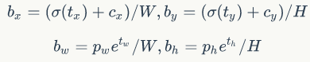

[中英文整理链接](https://github.com/SnailTyan/deep-learning-papers-translation)（只是一个归纳和整理，翻译得并不好）

#### RCNN（Region proposals-CNN）

1. 用 Selective Search 算法生成 $2000$ 个候选区域。
2. 借用 Alexnet 模型
	+ 将候选框获取的像素暴力缩放至适合 Alexnet 的大小（$227 \times 227$），方便带入 CNN 模型。
	+ Alexnet 接的是 $1000$ 分类器，这里改成 $20+1$ 分类器（网络最后一层作修改即可，$1$ 是背景）。训练时与 GroundTruth 的 IoU > 0.5 视为正样本，否则为负样本。
3. 训练完分类器后，去回归候选框，得到更精确的结果。
+ 用到了三个模型：CNN模型，SVM分类器，回归模型。

#### Fast RCNN

1. 与 RCNN 不同，无需带入多次候选框截取的图片，**只需在一开始带入整张图片**。
2. 将 region proposals 映射在 feature map 的对应位置。
	+ 不同候选框理应导出相同的特征向量，但是直接这么映射是不相同的。
	+ **采用 RoI 技术**，将每个候选框都划成 $H \times W$，每个小块做 Max Pooing。
3. 在候选框生成的等长特征向量里，分别接分类、回归两个口。同时采用**多任务损失函数(multi-task loss)**，将损失函数合在一起：
	$$L(u,v)=-\log p_u + \lambda \sum_{i \in \{ x,y,w,h\}} F(u_i-v_i)$$
    （$p_u$ 是对于正确标签的预测概率，$\lambda$ 是超参，$F(x)$ 是一个不易梯度爆炸的函数，作者取了 $F(x)=[|x| < 1]0.5x^2 + [|x| \ge 1]|x|-0.5 $）
+ 为了达成尺寸不变性，还在训练中使用了图像金字塔的方法。

#### Faster RCNN

+ 提出了 RPN (Region Proposal Networks) 网络
	- 设定 $k~(=9)$ 个 anchors，每个 anchors 固定面积或者长宽比生成。
	- 对 feature map 的每一个像素都开 $k$ 个 anchor（以它为中心）。
	- feature map 接 $1 \times 1$ 卷积层后，后接两种层：
		+ 分类：二分类，判断是前景还是后景，有 $2k$ 个分数。
		+ 回归：有上下左右四个边界，有 $4k$ 个坐标。
	
+ 训练 RPN 网络
	- 损失函数同 Fast RCNN。
	- 论文中提出，正样本有两种设置方法：
		1. 和标签 IoU 最高的样本。
		2. 所有与标签 IoU > 0.7 的样本。
	- 注意第 $2$ 种情况有时会不存在正样本。
+ 总框架训练
	- 对 RPN 网络出来的 proposals 进行 NMS
	- 取一部分（$=300$）出来进行 RoI Pooling，然后进入检测的训练。
	- 可以先训练 RPN 网络，再带到全网络里。这两者可以迭代训练。
+ 总结构图如图：
    

#### YOLO

+ [论文地址](http://arxiv.org/abs/1506.02640)。注：[参考此文章进行学习和总结](https://blog.csdn.net/guleileo/article/details/80581858)
+ 核心思想：利用整张图作为网络的输入，**直接在输出层回归 bounding box 的位置**及其所属的类别。
+ **划分网格来预测**
	- 将整个图片分成 $S \times S（=7）$ 的网格（每个网格是一个预测单元。如果有一个 object 中心落入其中，就由它进行预测）。
	- 每个网格会预测 $B（=2）$ 个 bounding box（一个 box 由坐标 $(x,y,w,h)$ 和置信度 confidence 组成）以及 $C$ 个 categories 的概率值 $P$。最终某个框 $i$ 代表某个种类 $j$ 的物体的概率即为：$P(B_i) \times P(C_j)$.
	- 所以一个网格最多只能预测一个物体。
+ 损失函数
	
    - 定位小物体的时候，差的绝对值也会变小，应该在数值上加强惩罚。
    - 论文选择了$f(x)=\sqrt x$，一定程度上缓解了这个问题，但没有本质改变。

#### YOLO2

+ 借鉴了 Anchor Boxes
	- Yolo 里回归边框时，图片的长和宽分别被单位化到 $[0,1]$，预测的长宽是基于原图的比例，所以 YOLOv1 在精确定位方面表现较差。
	- **YOLOv2 放大了初始图片大小（448）**，减少了一步下采样，使最终的 `feature map` 从 $7 \times 7$ 扩大到了 $13 \times 13$。同时，在每个位置开多个 anchor boxs，分别去预测一套分类概率值（解决了 v1 中只能预测一个的问题）。
+ 用 Dimension Clusters 设计先验框
	- 通过分析数据集的标签，设计比较优秀的先验框长宽。
	- 定义两个框的距离是 IorU。对标签跑 K-means，最终选取了 $5$ 个先验框。
+ 用 Darknet-19 代替 VGG-16 提取特征
+ 回归坐标
	- 在 RPN 结构里，是直接回归坐标值和中心的距离的。
	- YOLO模型里有**网格**的概念，而边界框在回归的时候，可以偏离当前网格落在图片任何位置，这会导致模型的不稳定性。YOLOv2就对这个偏离值进行了 `sigmod` 的约束，使得它在 $[0,1]$ 范围内。
	
    - $c_x,c_y$ 表示当前网格的左上角坐标，$W,H$ 是 `feature map` 长宽，$t_x,t_y$ 是去回归的值，$p_w,p_h$ 是某个先验框的长宽，$b_x,b_y,b_w,b_h$ 是最后预测值（不是很懂 **最后的长宽为什么是这么预测的**）。
+ Fine-Grained Features
	- 最后用来预测的 `feature map` 只有 $13 \times 13$，不太适合做细粒度的检测。
	- YOLOv2 提出了 passthrough 层用来提取细粒度的信息。
	- 在 Darknet-19 最后一层 pooling 前是 $26 \times 26 \times 512$ 的，将它接入 passthrough层，对每一个 $2 \times 2$ 的局部放到 channel 处，变成 $13 \times 13 \times 2048$。再把这个数据和之前 Darknet-19 出来的 $13 \times 13 \times 1024$ 串接。
	
+ 训练过程
	1. 在 ImageNet 上预训练 Darknet-19
	2. 将 $224 \times 224$ 调整成 $448 \times 448$，继续 finetune。
	3. 将 Darknet-19 从分类网络改成检测网络。