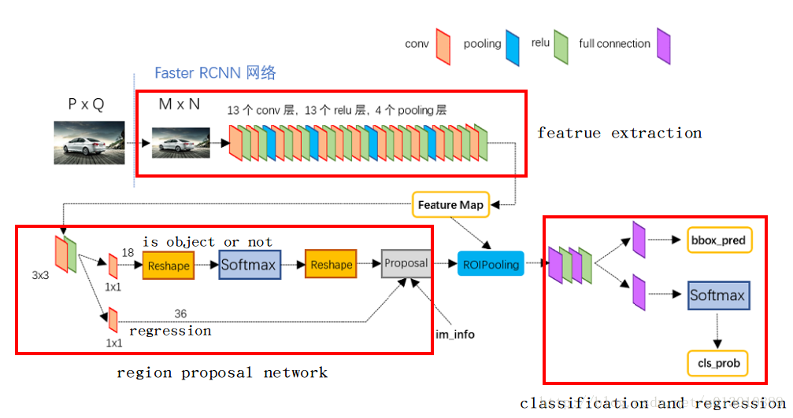
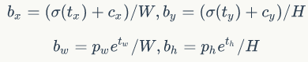
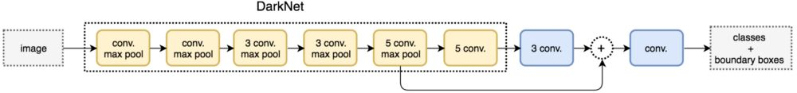

[中英文目录链接](https://github.com/SnailTyan/deep-learning-papers-translation)（只是一个整理列表，链接指向的内容翻译得并不好）

## R-CNN

R-CNN 即为 Region proposals-CNN。

1. 用 Selective Search 算法生成 $2000$ 个候选区域。
2. 借助 Alexnet 模型生成特征向量。
    + 将候选框获取的像素**缩放**至适合 Alexnet 的大小（$227 \times 227$）并带入提取特征。
    + 将得到的 $[2000,4096]$ 特征接入 $21$ 个 SVM分类器（$20$ 是预设的物体种类，$1$ 是背景）。
3. 训练这些 SVM分类器
	+ 每一类对 $2000$ 个候选框都打了分数，做一遍 NMS 后得到本次预测的若干位置。
    + 与 GroundTruth 的 IoU > 0.5 视为正样本，否则为负样本。
4. 训练完分类器后，去回归候选框得到更精确的结果。
+ 提出了一个新的思想：将别处的网络及参数迁移过来并做**微调**（fine-tune）。

## Fast R-CNN

1. 每个候选区域都带入CNN太慢了，**考虑只往CNN里放入整张图片**。
    + 对于每个 region proposals，找到它映射在 feature map 的对应位置。
    + 注意 region proposals 大小不一，所以采用 **RoI 技术**：将每个候选框划成均匀的 $H \times W$（论文里是 $7 \times 7$），每个小块做 Max Pooing。这样候选框接入 CNN 前大小一致了。
2. 将**分类**、**回归候选框位置**两个任务结合在一起。
    + CNN完接分类、回归两个出口：前者是 $21$ 个分类器，后者是 $20 \times 4$ 个实数。
    + 采用**多任务损失函数(multi-task loss)**：$L(u,v)=-\log p_u + \lambda \sum_{i \in \{ x,y,w,h\}} F(u_i-v_i)$。
    + 其中 $p_u$ 是对于正确标签的预测概率，$\lambda$ 是超参，$F(x)$ 是一个不易梯度爆炸的函数，作者取了 $F(x)=[|x| < 1] \cdot (0.5x^2) + [|x| \ge 1] \cdot (|x|-0.5)$。
+ 为了达成尺寸不变性，在训练中使用图像金字塔的方法。

## Faster R-CNN

+ 提出 **RPN** (Region Proposal Networks) 网络来自动生成候选区域
	- 设定 $k~(=9)$ 种 anchors，每个 anchor 固定面积或者长宽比生成。
	- 对于 CNN 跑出来的 feature map 的每一个像素都开 $k$ 个以它为中心的 anchor。
	- feature map 后接两种 $1 \times 1$ 卷积层：
		+ 分类：分别求前景和后景的概率（交叉熵损失函数），有 $2k$ 个卷积核。
		+ 回归：求上下左右四个边界，有 $4k$ 个卷积核。
	
+ 训练 RPN 网络
	- 损失函数同 Fast R-CNN。
	- 对于每个标签，选择 IoU 最高的候选框作为正样本；再随机选取一些与标签 IoU $> 0.7$ 的作为正样本。
	- 随机选取一些与标签 IoU $< 0.3$ 的作为负样本。
	
+ 总训练框架
	+ 训练完 RPN 网络后，为导出的 proposals 生成 RoI。
	+ 再把 RoI 带入CNN，后面的细节和 Fast R-CNN 类似。

	    

## YOLO

+ [论文地址](http://arxiv.org/abs/1506.02640)。注：[参考此文章进行学习和总结](https://blog.csdn.net/guleileo/article/details/80581858)
+ 核心思想：利用整张图作为网络的输入，**直接在输出层回归 bounding box 的位置**及其所属的类别。
+ **划分网格来预测**
	- 将整个图片分成 $S \times S（=7）$ 的网格（每个网格是一个预测单元。如果有一个 object 中心落入其中，就由它进行预测）。
	- 每个网格会预测 $B（=2）$ 个 bounding box（一个 box 由坐标 $(x,y,w,h)$ 和置信度 confidence 组成）以及 $C$ 个 categories 的概率值 $P$。最终某个框 $i$ 代表某个种类 $j$ 的物体的概率即为：$P(B_i) \times P(C_j)$.
	- 所以一个网格最多只能预测一个物体。
+ 损失函数
	
    - 定位小物体的时候，差的绝对值也会变小，应该在数值上加强惩罚。
    - 论文选择了$f(x)=\sqrt x$，一定程度上缓解了这个问题，但没有本质改变。

## YOLO2

+ 借鉴了 Anchor Boxes
	- Yolo 里回归边框时，图片的长和宽分别被单位化到 $[0,1]$，预测的长宽是基于原图的比例，所以 YOLOv1 在精确定位方面表现较差。
	- **YOLOv2 放大了初始图片大小（448）**，减少了一步下采样，使最终的 `feature map` 从 $7 \times 7$ 扩大到了 $13 \times 13$。同时，在每个位置开多个 anchor boxs，分别去预测一套分类概率值（解决了 v1 中只能预测一个的问题）。
+ 用 Dimension Clusters 设计先验框
	- 通过分析数据集的标签，设计比较优秀的先验框长宽。
	- 定义两个框的距离是 IorU。对标签跑 K-means，最终选取了 $5$ 个先验框。
+ 用 Darknet-19 代替 VGG-16 提取特征
+ 回归坐标
	- 在 RPN 结构里，是直接回归坐标值和中心的距离的。
	- YOLO模型里有**网格**的概念，而边界框在回归的时候，可以偏离当前网格落在图片任何位置，这会导致模型的不稳定性。YOLOv2就对这个偏离值进行了 `sigmod` 的约束，使得它在 $[0,1]$ 范围内。
	
    - $c_x,c_y$ 表示当前网格的左上角坐标，$W,H$ 是 `feature map` 长宽，$t_x,t_y$ 是去回归的值，$p_w,p_h$ 是某个先验框的长宽，$b_x,b_y,b_w,b_h$ 是最后预测值（不是很懂 **最后的长宽为什么是这么预测的**）。
+ Fine-Grained Features
	- 最后用来预测的 `feature map` 只有 $13 \times 13$，不太适合做细粒度的检测。
	- YOLOv2 提出了 passthrough 层用来提取细粒度的信息。
	- 在 Darknet-19 最后一层 pooling 前是 $26 \times 26 \times 512$ 的，将它接入 passthrough层，对每一个 $2 \times 2$ 的局部放到 channel 处，变成 $13 \times 13 \times 2048$。再把这个数据和之前 Darknet-19 出来的 $13 \times 13 \times 1024$ 串接。
	
+ 训练过程
	1. 在 ImageNet 上预训练 Darknet-19
	2. 将 $224 \times 224$ 调整成 $448 \times 448$，继续 finetune。
	3. 将 Darknet-19 从分类网络改成检测网络。