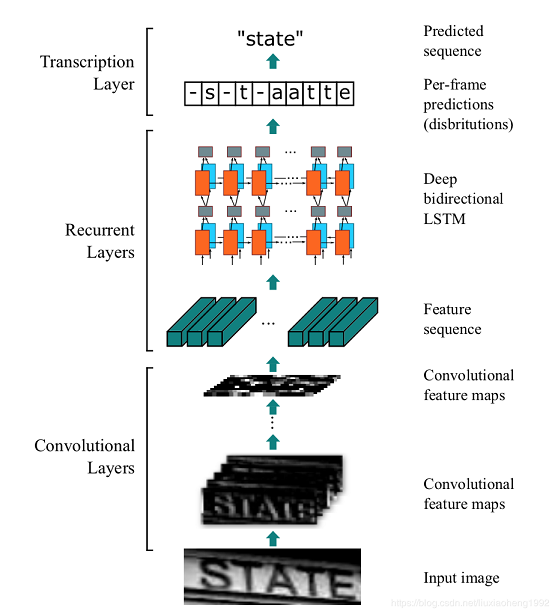
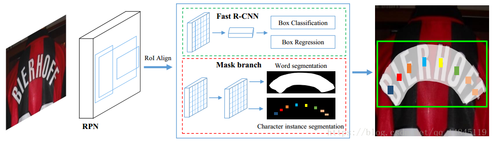
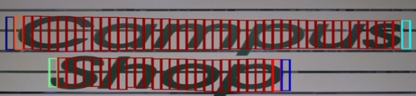
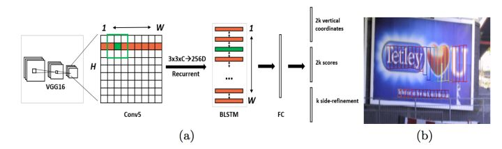

## CRNN

+ [论文地址](https://arxiv.org/abs/1507.05717)
+  **经典的端到端训练**。通过 CNN 将图片的特征提取出来后采用 RNN 对序列进行预测，最后通过一个 CTC 的翻译层得到最终结果。说白了就是 `CNN + RNN + CTC`的结构。
	
+ CNN 是直接在 VGG 基础上修改的。序列识别时，要求图片的维度是 $W \times 32$（宽度任意，高度要 resize 成 32）。将 VGG 网络的第三层、第四层 `pooling` 的卷积核从 $2 \times 2$ 改成 $1 \times 2$。结合四层 `pooling` 和最后一层 `conv`，卷积完成后的维度是 $\frac{W}{4} \times 1$。
+ 双向 RNN，用 LSTM 作为基本结构。
+ 结尾处直接套一个 `CTC` 算法。

## Mask TextSpotter

+ **端到端**，旨在处理 STS（Scene Text Spotting）问题。
+ 大部分做法都是把检测和识别分开。Mask TextSpotter 受到 Mask R-CNN 的启发，通过分割文本区域检测文本，**从而能识别弯曲的文本。**
+ 训练结构
	
+ ROI
	- ROI Pooling
		+ 在传统的两级检测框架中，常用 ROI Pooling 作为原图像和 `feature map` 的转化
		+ 预选框回归后是浮点数，从原图转到 `feature map` 取整会丢失像素，在割 $k \times k$ 特征池化的时候也会遇到不整除的问题。这些问题累积后，还原到原图上就会有很大的误差。
		+ 该现象被称为 **不匹配问题（misalignment）**。
	- ROI Align
		+ 该思想在 **Mask-RCNN** 中首先被提出。
		+ ROI Align 在遍历候选区域、分割单元的时候都不做取整处理。
		+ 在每个单元中计算固定四个坐标位置，（由于坐标是浮点数）采用双线性插值去插出这四个位置的值，然后进行最大池化操作。
		+ **要注意反向传播的问题**，先留个坑。
+ 创新点 **Mask Branch**：

## CTPN（Connectionist Text Proposal Network）

+ 从 Faster R-CNN 修改而来。
+ 继承了 Anchor 的思想。作者限定了 Anchor 的宽度 $w=16$，而高度在 $[11,273]$ 之间等比设置 $10$ 个。
	
+ 基本步骤
	1. 用 VGG16 的前 $5$ 个 Conv stage 得到 feature map.
	2. 用 $3 \times 3$ 的滑动窗口在前一步得到的 feature map 上提取特征（每单位都结合邻域，一般是周围九宫格提取，也有实现是取横着一排九个），所以输出为 $[N,9C,H,W]$.
	3. 将 $Batch=NH$，最大时间 $T_{max}=W$ 的数据流输入到**双向 LSTM**，学习每一行的序列特征。双向 LSTM 输出为 $[(NH),W,256]$，reshape 成 $[N,256,H,W]$.
	4. 经过 FC 层，变成 $[N,512,H,W]$.
	5. 输出层和 Faster RCNN 类似。如果每个单位预测 $k$ 个 Anchor 的话，回归 $2k$ 个坐标（矩形高度和中心的 $y$ 偏移值）和 $2k$ 个分数（是文字/不是文字）以及 $k$ 个 side-refinement（表示每个 proposal 的水平平移量，用来精修文本行的两个端点）。
	6. 做一遍 NMS 后，使用基于图的文本行构造算法，将得到的一个一个的文本段合并成文本行。
	
+ 训练
	- 坐标最终计算同 Faster RCNN，loss 即为三个回归值的超参结合。
	- 定义 IoU $> 0.7$ 和最大值为正样本（哈哈干脆两个都用上了），$< 0.5$ 为负样本。
+ 文本段合并的规则
	- 只保留分数 $> 0.7$ 的框。
	- 定义 $(i,j)$ 临近为：
        - $j$ 和 $i$ 的水平距离小于 $50$ pixel
        - 垂直方向重叠 $> 0.7$
    - 从框 $i$ 出发，找到和它临近的分数最高的框 $j$；再从 $j$ 反方向出发，找到对应的 $k$。
    - 如果 $score_i \ge score_k$，说明这是一个“最长的连接”，那么设 $G_{i,j}=True$
    - 这样我们可以对 $N$ 个框建出一个 $N^2$ 的图了。
