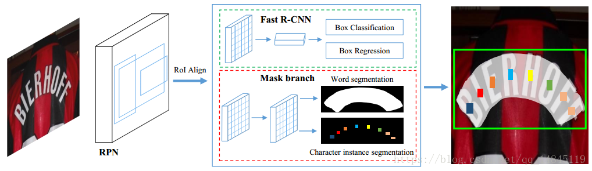

## CRNN

+ [论文地址](https://arxiv.org/abs/1507.05717)
+  **经典的端到端训练**。通过 CNN 将图片的特征提取出来后采用 RNN 对序列进行预测，最后通过一个 CTC 的翻译层得到最终结果。说白了就是 `CNN + RNN + CTC`的结构。
	
+ CNN 是直接在 VGG 基础上修改的。序列识别时，要求图片的维度是 $W \times 32$（宽度任意，高度要 resize 成 32）。将 VGG 网络的第三层、第四层 `pooling` 的卷积核从 $2 \times 2$ 改成 $1 \times 2$。结合四层 `pooling` 和最后一层 `conv`，卷积完成后的维度是 $\frac{W}{4} \times 1$。
+ 双向 RNN，用 LSTM 作为基本结构。
+ 结尾处直接套一个 `CTC` 算法。

## Mask TextSpotter

+ **端到端**，旨在处理 STS（Scene Text Spotting）问题。
+ 大部分做法都是把检测和识别分开。Mask TextSpotter 受到 Mask R-CNN 的启发，通过分割文本区域检测文本，**从而能识别弯曲的文本。**
+ 训练结构
	
+ ROI
	- ROI Pooling
		+ 在传统的两级检测框架中，常用 ROI Pooling 作为原图像和 `feature map` 的转化
		+ 预选框回归后是浮点数，从原图转到 `feature map` 取整会丢失像素，在割 $k \times k$ 特征池化的时候也会遇到不整除的问题。这些问题累积后，还原到原图上就会有很大的误差。
		+ 该现象被称为 **不匹配问题（misalignment）**。
	- ROI Align
		+ 该思想在 **Mask-RCNN** 中首先被提出。
		+ ROI Align 在遍历候选区域、分割单元的时候都不做取整处理。
		+ 在每个单元中计算固定四个坐标位置，（由于坐标是浮点数）采用双线性插值去插出这四个位置的值，然后进行最大池化操作。
		+ **要注意反向传播的问题**，先留个坑。
+ 创新点 **Mask Branch**：

## CTPN（Connectionist Text Proposal Network）

+ 基本步骤
	1. 用 VGG16 的前 $5$ 个 Conv stage 得到 feature map.
	2. 