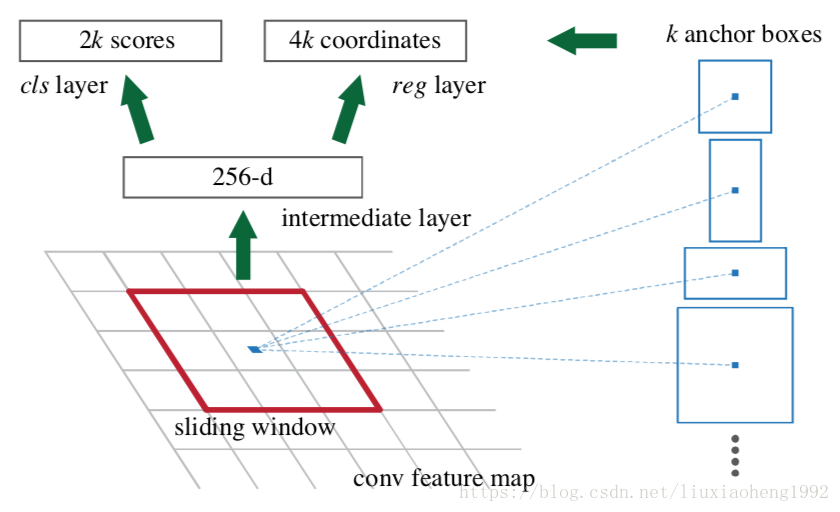

#### RCNN（Region proposals-CNN）

1. 用 Selective Search 算法生成 $2000$ 个候选区域。
2. 借用 Alexnet 模型
	+ 将候选框获取的像素暴力缩放至适合 Alexnet 的大小（$227 \times 227$），方便带入 CNN 模型。
	+ Alexnet 接的是 $1000$ 分类器，这里改成 $20+1$ 分类器（网络最后一层作修改即可，$1$ 是背景）。训练时与 GroundTruth 的 IoU > 0.5 视为正样本，否则为负样本。
3. 训练完分类器后，去回归候选框，得到更精确的结果。
+ 用到了三个模型：CNN模型，SVM分类器，回归模型。

#### Fast RCNN

1. 与 RCNN 不同，无需带入多次候选框截取的图片，**只需在一开始带入整张图片**。
2. 将 region proposals 映射在 feature map 的对应位置。
	+ 不同候选框理应导出相同的特征向量，但是直接这么映射是不相同的。
	+ **采用 RoI 技术**，将每个候选框都划成 $H \times W$，每个小块做 Max Pooing。
3. 在候选框生成的等长特征向量里，分别接分类、回归两个口。同时采用**多任务损失函数(multi-task loss)**，将损失函数合在一起：
	$$L(u,v)=-\log p_u + \lambda \sum_{i \in \{ x,y,w,h\}} F(u_i-v_i)$$
    （$p_u$ 是对于正确标签的预测概率，$\lambda$ 是超参，$F(x)$ 是一个不易梯度爆炸的函数，作者取了 $F(x)=[|x| < 1]0.5x^2 + [|x| \ge 1]|x|-0.5 $）
+ 为了达成尺寸不变性，还在训练中使用了图像金字塔的方法。

#### Faster RCNN

+ 提出了 RPN (Region Proposal Networks) 网络
	- 设定 $k(=9)$ 个 anchors，每个 anchors 固定面积或者长宽比生成。
	- 对 feature map 的每一个像素都开 $k$ 个 anchor（以它为中心）。
	- feature map 接 $1 \times 1$ 卷积层后，后接两种层：
		+ 分类：二分类，判断是前景还是后景，有 $2k$ 个分数。
		+ 回归：有上下左右四个边界，有 $4k$ 个坐标。
	

+ 总的结构图如图：

    

## CTPN（Connectionist Text Proposal Network）

+ 基本步骤
	1. 用 VGG16 的前 $5$ 个 Conv stage 得到 feature map.
	2. 